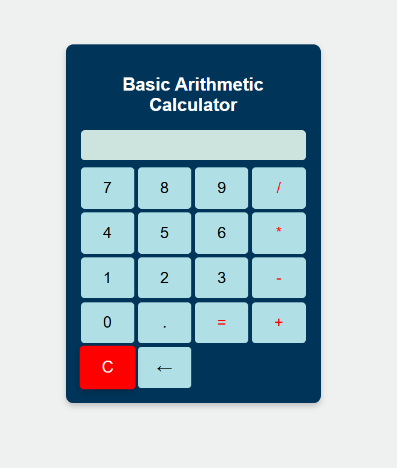
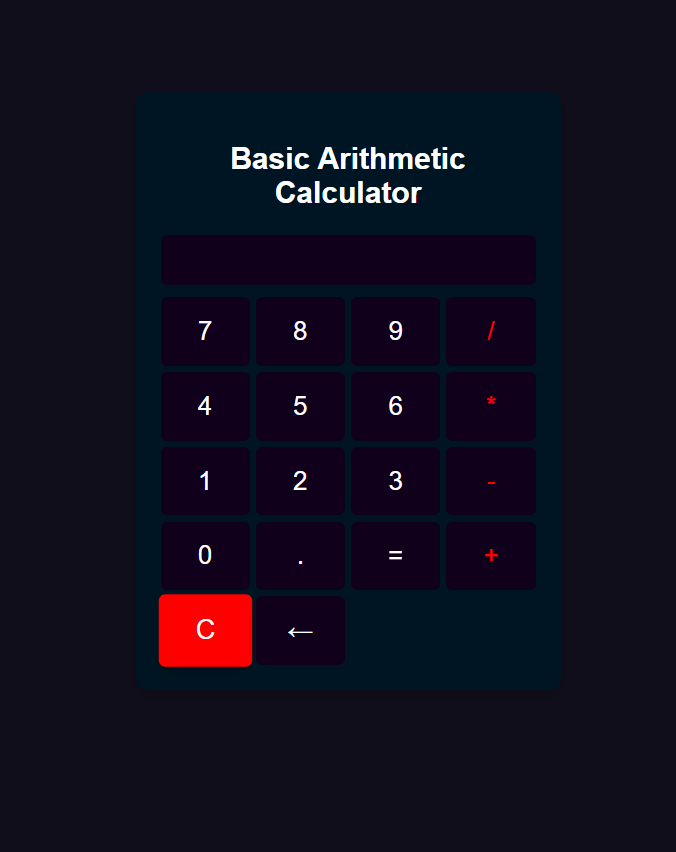

# Basic-Arithmetic-Calculator
A simple, responsive basic arithmetic calculator built with HTML, CSS, and JavaScript.

## Features :

* **Basic Arithmetic Operations:** Addition, subtraction, multiplication, and division.
* **Responsive Design:** Adapts to various screen sizes.
* **Keyboard Input:** Supports number and operator input from the keyboard.
* **Backspace Functionality:** Allows users to delete the last entered digit.
* **Clear Button:** Resets the calculator to its initial state.


## Technologies Used

* HTML
* CSS
* JavaScript

## How to Use

1.  Clone the repository to your local machine:

    ```bash
    git clone https://github.com/AshutoshSaraff/Basic-Arithmetic-Calculator
    ```

2.  Open the `index.html` file in your web browser.

3.  Use the mouse or keyboard to interact with the calculator.

## Calculator Interface 


## Calculator New Interface (Dark Mode)

